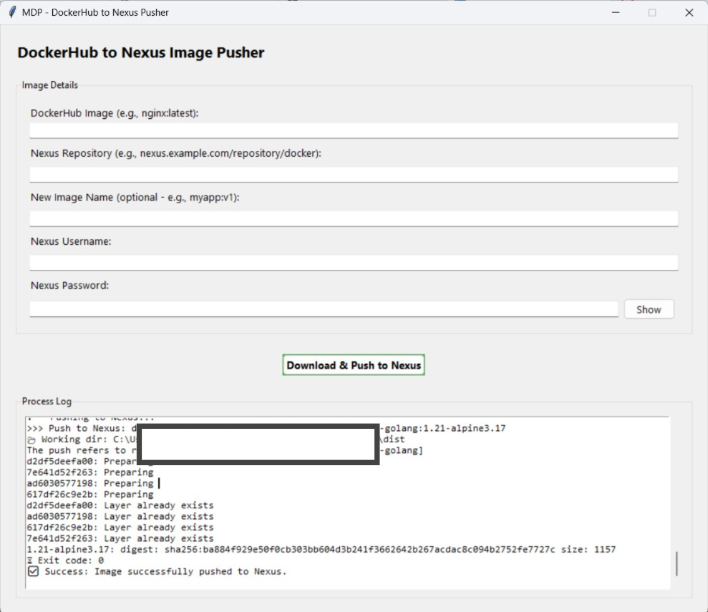

# dockerhub-image-pusher 🐳

A simple Python GUI tool built with `tkinter` that helps you push Docker images to Docker Hub more easily.  
It supports background processing with threading and provides a user-friendly interface for interaction.

---

## ✅ Python Compatibility

- Tested with **Python 3.12**
- Only requires `pyinstaller` if you want to build a standalone `.exe`

---

## 📦 Requirements

- Python 3.12 (https://www.python.org/downloads/)
- `pyinstaller` (optional, for .exe creation)

---

## 📁 Project Structure

```
dockerhub-image-pusher/
├── main.py
├── requirements.txt
└── README.md
```

---

## 📥 Installation

1. **Clone or download this repository:**

   ```bash
   git clone https://github.com/ekobcode/dockerhub-image-pusher.git
   cd dockerhub-image-pusher
   ```

2. **(Optional) Create virtual environment:**

   ```bash
   python -m venv venv
   # Windows
   venv\Scripts\activate
   # macOS/Linux
   source venv/bin/activate
   ```

3. **Install dependencies:**

   ```bash
   pip install -r requirements.txt
   ```

4. **Image:**

   

---

## ▶️ Run the App

To start the application:

```bash
python main.py
```

You will see the `dockerhub-image-pusher` GUI appear.

---

## 🛠️ Build Standalone Executable (.exe)

To distribute the app as a Windows `.exe`:

1. **Install PyInstaller (latest version recommended for Python 3.12):**

   ```bash
   pip install --upgrade pyinstaller
   ```

2. **Build the executable:**

   ```bash
   pyinstaller --onefile --noconsole main.py
   ```

3. **Output:**
   - Find the `.exe` in the `dist/` folder.
   - You can share that file to run without Python installed.

---

## ❓ FAQ

**Q: Do I need to install tkinter?**  
A: No. `tkinter` is included with Python 3.12 by default.

**Q: Why is the .exe file size large?**  
A: PyInstaller bundles the entire Python runtime to make the app portable.

---

## 📃 License

This project is licensed under the [MIT License](LICENSE).

---

## 🤝 Contributing

Feel free to submit pull requests or suggest improvements. PRs are welcome!